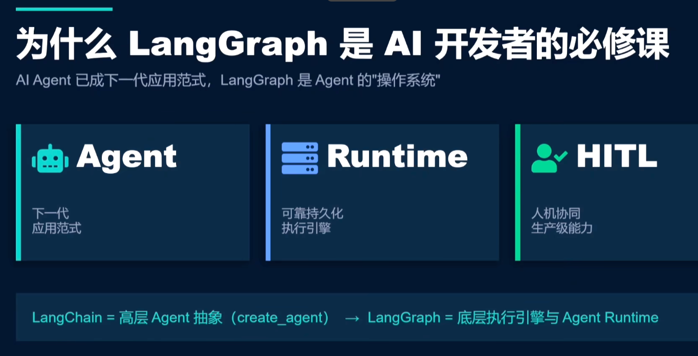
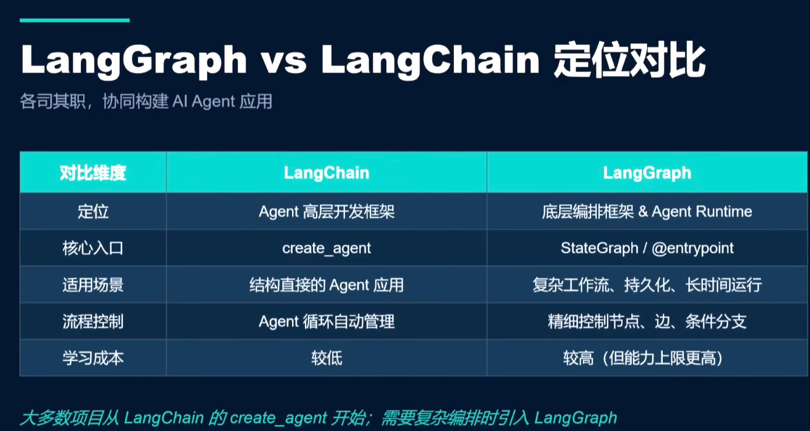

# 从入门部署到企业级的AI agent应用

从底层源码构建ai agent

## 为什么要学习langgraph。

现在已经全面进入ai agent时代，各个公司都在构建自己独一无二的agent产品，langgraph被称为agent的操作系统
以非常可靠的持久化执行引擎和完善的人机协同能力，在ai agent生态中占据不可或缺的地位。

## langgraph与langchain对比
langgraph与langchain 并不是对立的关系，而是协同工作的关系，推荐先学习langchain。
langchain倾向于顶层的应用设计，让用户快速上手构建自己的agent，而langgraph更倾向底层源码的架构编排。

大多数的项目都是从langchain的create_agent开始，让其在底层对接一个大语言模型，然后就可以工作了。如果需要一个复杂的编排逻辑，此时再引入langgraph

